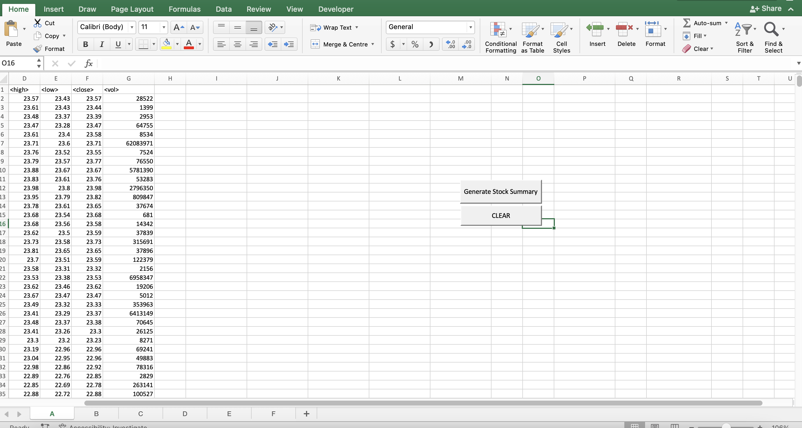
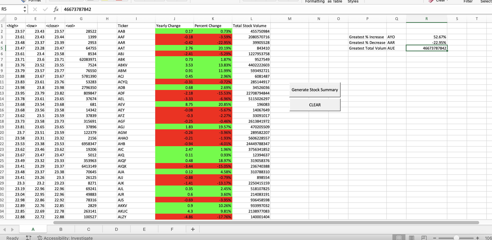

# Automated stock data with VBA
This repository contains a VBA file ```VBA_challenge_code.vb``` that automates a summary of stock information.


Clicking the ```Generate Stock Summary``` button adds columns to each worksheet that provides ```Yearly Change```, ```Percent Change```, and ```Total Stock Volume``` for each stock. It also provides a report of ```Greatest % Increase```, ```Greatest % Decrease``` and ```Greatest Total Volume``` for each sheet. Clear button removes all summary information to original state.


